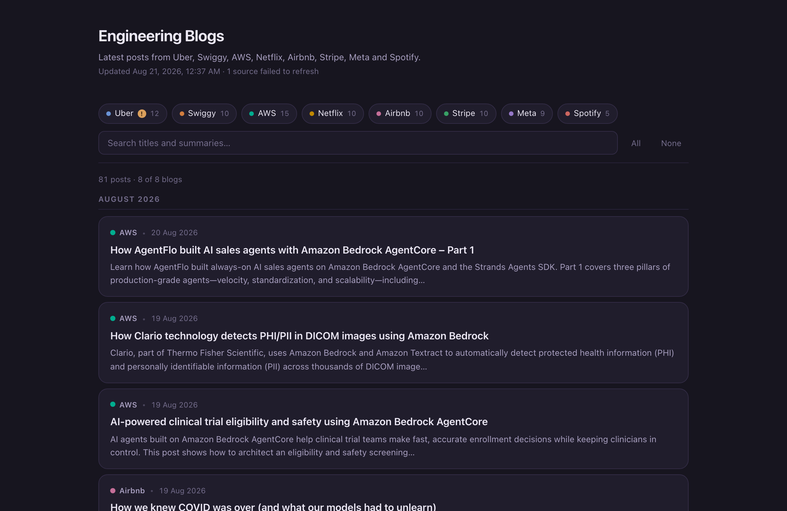
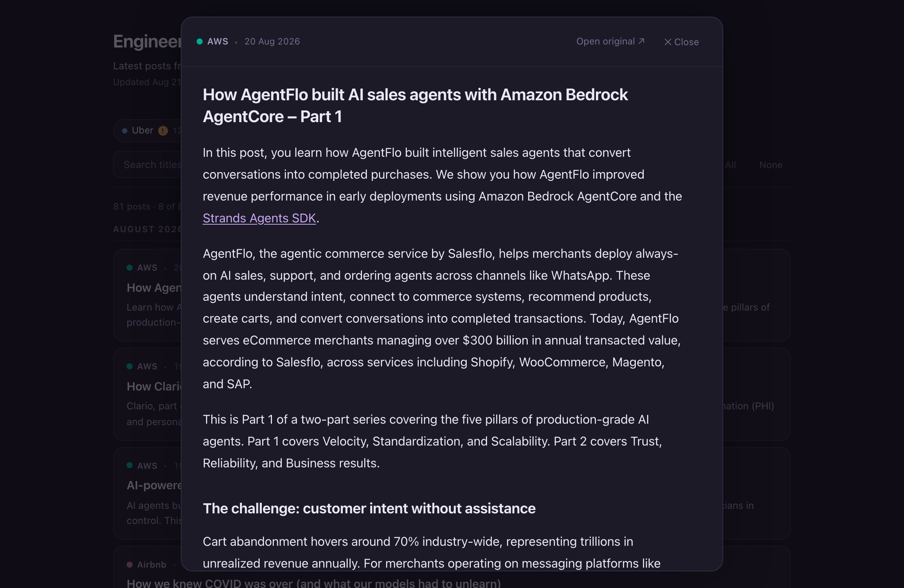

# Engineering Blogs Feed

**Live: [divyanshu0x16.github.io/engineering-blogs-feed](https://divyanshu0x16.github.io/engineering-blogs-feed/)**

One page with the latest posts from the engineering blogs worth reading —
Uber, AWS, Netflix, Airbnb, Meta, Spotify, Stripe and Swiggy. Filter by
company, search across titles and summaries, grouped by month. Posts open
in an in-page reading mode when full content could be extracted, falling
back to the original site otherwise.

No server, no database, no JavaScript framework. A Python script pulls the
feeds, a template renders them into a single self-contained `index.html`, and
GitHub Actions rebuilds it every morning.

<p>
  
  
</p>

## Quick start

```bash
pip install -r requirements.txt
python build.py --serve
```

That fetches every feed, renders `index.html`, and opens a local server at
<http://localhost:8000>.

Working on the design? Skip the network round-trip:

```bash
python build.py --no-fetch --serve
```

## Adding a blog

Edit `sources.yaml`:

```yaml
  - id: cloudflare
    name: Cloudflare
    color: "#E8871A"
    site: https://blog.cloudflare.com/
    type: rss
    feed: https://blog.cloudflare.com/rss/
```

Then `python build.py`. Six more verified feeds are commented out at the
bottom of that file, ready to uncomment.

Blogs with no RSS feed need `type: scrape` plus a function in
`scripts/scrapers.py` — see `scrape_uber()` for the pattern.

## Syncing read state across devices

Clicking a post (or its dot) marks it read; **Unread only** filters down to
what's left. This is tracked in `localStorage`, so by default it's per
browser/device and won't follow you from laptop to phone.

To sync it: click **Sync**, paste a GitHub [personal access token
(classic)](https://github.com/settings/tokens) with only the **`gist`**
scope checked. The page finds or creates a private gist named
`engineering-blogs-feed-state.json` under your account and keeps it in
sync. On a second device, click **Sync** and paste the *same* token — no
gist ID to copy around. This is the one feature that makes a network
request from the page itself; skip it and everything else still works
fully offline.

## Deploying to GitHub Pages

1. Push this repo to GitHub.
2. **Settings → Pages → Source**, choose **GitHub Actions**.
3. **Settings → Actions → General → Workflow permissions**, choose
   **Read and write permissions**.

`.github/workflows/build.yml` then rebuilds daily at 06:00 UTC (11:30 IST),
on every push to `main`, and on demand from the Actions tab. Your feed lives
at `https://<username>.github.io/<repo>/` — see the live link at the top of
this README for this repo's own deployment.

To change the schedule, edit the `cron` line in that workflow.

## How it works

```
sources.yaml → scripts/fetch.py → data/posts.json → build.py → index.html
                                                  ↑
                                        template.html
```

Fetching and rendering are separate steps. `data/posts.json` is committed, so
the site rebuilds without network access and a temporarily dead feed can't
wipe out your content — a failed source keeps its previous posts and shows a
small warning badge on its chip.

## Layout

| Path | What it does |
|---|---|
| `sources.yaml` | The blog list. The main thing you edit. |
| `scripts/fetch.py` | Fetches all sources in parallel, normalises, writes JSON. |
| `scripts/extract.py` | Best-effort full-article extraction for reading mode, cached by URL. |
| `scripts/scrapers.py` | Custom scrapers for feedless blogs. |
| `build.py` | Renders JSON + template into `index.html`. |
| `template.html` | The page itself — inline CSS and JS, one `__DATA__` placeholder. |
| `data/posts.json` | Fetch output, committed as the offline fallback. |
| `CLAUDE.md` | Architecture notes and conventions for Claude Code. |

## License

MIT. Post titles, summaries and links belong to their respective publishers;
this only aggregates public feeds.
